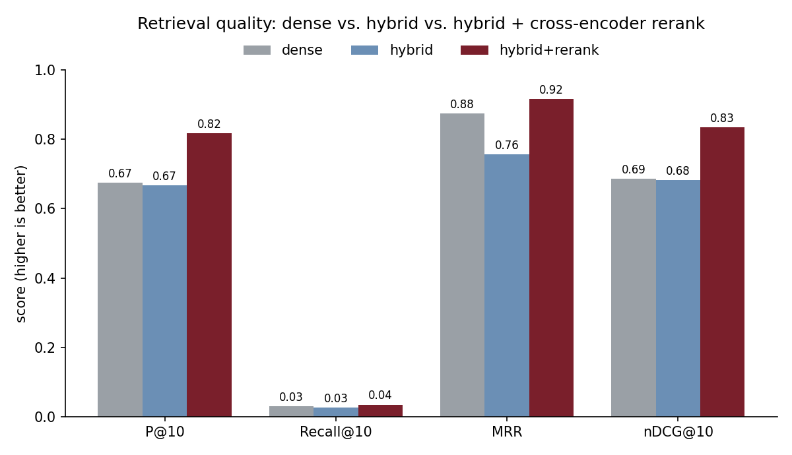

<p align="center">
  
</p>

# Wine Sommelier RAG

Ask for a wine in plain English — *"a bold red under $25 for steak night"*, *"a
crisp Austrian white with citrus"* — and get **2–3 real recommendations, cited to
professional reviews**, from a searchable index of ~130,000 Wine Enthusiast
tastings. A retrieval-augmented sommelier that never invents a bottle.

> 🌐 **Overview:** https://lyhjeremy.github.io/wine-sommelier-rag/

## Why
Wine search is either keyword filters (useless for *"something like a Rhône but
cheaper"*) or a chatbot that hallucinates vintages and scores. RAG fixes both:
**retrieve** the most relevant real reviews with a local semantic index, then let
**Claude** recommend *only* from what was retrieved — with a `[n]` citation on
every pick so you can trust it.

## How it works

<p align="center">
  
</p>

- **Hybrid retrieval, then rerank.** Candidates come from *both* a dense vector
  search (`sentence-transformers` + Chroma) **and** a BM25 keyword index, fused
  with Reciprocal Rank Fusion; a **cross-encoder** then reranks the shortlist by
  reading query and review together. All local and free — no API key, nothing
  leaves your machine.
- **Generation** runs on the **Claude CLI** by default (uses your Claude
  subscription, no per-token cost). Set `ANTHROPIC_API_KEY` to use the API instead.
- **Grounded:** the sommelier is instructed to recommend only from retrieved
  reviews and cite each one; if nothing matches, it says so.

## Retrieval, measured

"Better retrieval" is a claim you can test, so I did. `src/eval.py` scores three
retrievers on 12 rubric-labelled queries — relevance defined by explicit grape /
price / style rules, a transparent (if imperfect) proxy for human judgement:

<p align="center">
  
</p>

| system | P@10 | MRR | nDCG@10 |
|---|---|---|---|
| dense (vector only) | 0.68 | 0.88 | 0.69 |
| dense + BM25 (RRF) | 0.67 | 0.76 | 0.68 |
| **+ cross-encoder rerank** | **0.82** | **0.92** | **0.83** |

The honest finding: **naive fusion alone doesn't help** — bolting on BM25 drags
in lexical-but-off-topic matches and even dents MRR. The **cross-encoder reranker**
is the lever that matters, lifting precision and nDCG ~21% over the dense baseline.
Reproduce with `python -m src.eval`.

## Quick start
```bash
pip install -r requirements.txt

python fetch_data.py                 # download the ~130k-review dataset -> data/
python -m src.ingest --limit 30000   # build the local vector index (or --all)

python -m src.cli ask "a bold red under $25 for a steak dinner" --max-price 25
python -m src.cli chat               # interactive sommelier
python -m src.eval                   # benchmark retrieval quality (optional)
```

Compare retrieval modes on any query with `--no-hybrid` (dense only) and
`--no-rerank` (skip the cross-encoder).

Filters compose with the natural-language query:
```bash
python -m src.cli ask "elegant and mineral, great with oysters" \
    --country France --variety "Chablis" --max-price 40 --min-points 90
```

## Files
| File | What it is |
|---|---|
| `fetch_data.py` | Download the Wine Enthusiast 130k-review dataset |
| `src/ingest.py` | Clean reviews → documents → local embeddings → Chroma index |
| `src/embedder.py` | Local sentence-transformers embedder (free, offline) |
| `src/retriever.py` | Dense vector search + metadata filters (the baseline) |
| `src/hybrid.py` | Dense + BM25 → RRF fusion → cross-encoder reranking |
| `src/eval.py` | Retrieval-quality benchmark (P@k, Recall@k, MRR, nDCG@k) |
| `src/sommelier.py` | The RAG chain: retrieve → grounded, cited recommendation |
| `src/llm.py` | LLM wrapper — Claude CLI (default) or Anthropic API |
| `src/cli.py` | `ask` (one-shot) and `chat` (interactive) commands |

## Notes
Ships **code only** — the dataset and vector index are downloaded/built locally and
git-ignored. Recommendations are drawn from professional reviews for personal use.
Tested end to end: a query retrieves real bottles and returns a cited pick.

## License
[MIT](LICENSE) © 2026 Jeremy Lee
