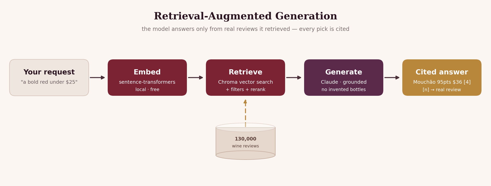

  

# Building a Wine Sommelier with RAG

*How I turned 130,000 wine reviews into a recommender that never invents a bottle.*

## The problem with asking an LLM for wine

Ask a chatbot "recommend a bold red under $25 for steak" and it will happily
name a specific producer, vintage, score and price — some of which are simply
made up. Ask a wine site the same thing and you get keyword filters that can't
understand "bold" or "for steak." Neither is trustworthy.

**Retrieval-augmented generation (RAG)** resolves the tension. Instead of asking
the model what it *remembers*, you first **retrieve** real, relevant documents,
then ask the model to answer *only from those*. The model supplies the language
and judgement; the data supplies the facts.

## The data

The [Wine Enthusiast 130k-review dataset](https://www.kaggle.com/datasets/zynicide/wine-reviews)
— ~130,000 professional tastings, each with a free-text note, an 80–100 score,
price, grape variety, winery and region. After de-duplication that's a rich,
grounded corpus of exactly the thing an LLM tends to hallucinate: concrete
bottles with real scores and prices.

## The pipeline

  

1. **Documents.** Each review becomes a short passage — `title — variety from
   region, country.\n<tasting note>` — with score, price and origin kept as
   structured metadata.
2. **Embeddings (local, free).** `all-MiniLM-L6-v2` via sentence-transformers
   turns each passage into a 384-dim vector, on the Mac GPU (MPS). No API key,
   nothing leaves the machine — ~30k reviews index in a couple of minutes.
3. **Vector store.** Chroma with cosine similarity, persisted to disk.
4. **Retrieval + rerank.** A query is embedded and matched; structured filters
   (`price ≤ 25`, `country = France`, `points ≥ 90`) are pushed down into the
   vector search as metadata constraints. The candidate pool is then reranked by
   `0.8 × similarity + 0.2 × normalized rating`, so among equally-relevant wines
   the better-reviewed bottle surfaces first.
5. **Grounded generation.** The top reviews are handed to Claude with a strict
   system prompt: recommend *only* from the retrieved wines, cite each with `[n]`,
   and if nothing fits, say so. Generation runs on the Claude CLI (my Claude
   subscription — no per-token cost), or the Anthropic API if a key is set.

## Does it work?

Asked for *"a bold, full-bodied red for a steak dinner, not too expensive"* with
a `$40` cap, it retrieved six real bottles and reasoned about them like a somm —
setting aside the perfumed Nebbiolos as "too elegant and light-framed for what
you're after" and recommending the dense, grippy **Mouchão Alentejano (95 pts,
$36)** as the steak wine, each pick cited back to its review. Every bottle,
score and price in the answer is real and traceable.

## Design decisions worth noting

- **Retrieval stays local and free** — the expensive, privacy-sensitive part
  (embedding your whole corpus) needs no external service.
- **Metadata filters are pushed into the vector query**, not applied afterwards,
  so a "$25 max" request never wastes retrieval slots on $80 bottles.
- **Citations are structural, not cosmetic** — the `[n]` indices map to the exact
  reviews shown beneath every answer, so the recommendation is auditable.

## Limitations & next steps

- The dataset is a single-publication snapshot; it inherits Wine Enthusiast's
  house style and coverage gaps.
- Constraint parsing is currently via explicit CLI flags; a natural-language
  constraint extractor (e.g. "under twenty bucks" → `max_price=20`) is the
  obvious next step — and a natural bridge to the agentic
  [Wine Pairing Agent](https://github.com/lyhjeremy) companion project.
- Reranking is a simple linear blend; a cross-encoder reranker would sharpen the
  top-k further at some latency cost.

*Code: [github.com/lyhjeremy/wine-sommelier-rag](https://github.com/lyhjeremy/wine-sommelier-rag)*
